# Traveller Terminal App

### Important links:

Git Repo - [Git Repo](https://github.com/maxckelly/travelApp)


## How to Run

This file will help you get the Traveller App up and running and help you navigate through the app to have a good experience. 

To build the app run:

```
bash build.sh
```

```
ruby app.rb
```

### Before you begin running the application please follow the below steps:

1. Make sure you have ruby installed on your machine - I used `rbenv` - This requires homebrew to install correct version
2. Clone repo ``` git clone https://github.com/maxckelly/travelApp.git ```
3. `cd` into the directory you've cloned
4. Run the build shell script file in your terminal. This will install all necessary GEMS - Do this by typing `bash build.sh`
5. `cd` into the `dist` directory and ensure that you have the following files app.rb, countries_method.rb, countries.json, travel_methods.rb, trips_class.rb, user_class.rb. 
6. App.rb is dependant on the following files: countries_method.rb, travel_methods.rb, trips_class.rb, user_class.rb. While countries_method.rb is dependant on just countries.json.
7. Once build.sh has installed the necessary gems and all files listed above are confirmed you can begin to run the application by typing into the terminal `ruby app.rb` - This will begin running the application.

### How to navigate around Traveller
- You will be presented by the following questions 1. Your name 2. Your email and 3. Your password. Please ensure email is valid - e.g. name@hotmail.com
- Once the above questions have been entered into the system you will have the option to select from a menu. The menu will display the below options. To select from the following menu you can use the up and down arrows and enter to select your option.
    1. "View my details"
    2. "View my trips"
    3. "Create a trip"
    4. "Spin the globe"
    5. "Download Itinerary"
    6. "Exit app"
- Option number 1 will direct you to view your basic information such as email, and name.
- Option number 2 will direct you to view your upcoming trips. Please note this will display a message if you currently don't have any trips in the system.
- Option number 3 will direct you to create a trip. This will then ask you a series of questions such as the location you're leaving, location your arriving at, dates of departure and dates of trip end.
- Option number 4 gives you the option to let the Traveller App decide where your next trip will be. Simply select this Spin the Globe and let us the select a random country for your next trip.
- Option 5 will direct you to download your Itinerary, this will display in a file called itinerary.csv
- Option 6 will exit the application for you. 


# Software development plan
## About Traveller

### Description
Traveller is a terminal app helping the user plan out their upcoming trips. Traveller allows the user to create trips and view trips and download the itinerary and create ‘random’ trips. The main focus of Traveller is to work with international trips which involve flying and travelling at large distances.

### The problem we're fixing
The problem we’re solving with Traveller app is to remove the complicated and time consuming task of planning a trip and easily organise and collate your travel itinerary. At this current stage users are very time poor and the organisation of a trip is largely taken up by the admin. Traveller plans to simply display all the trips which the user is planning in an organised and simple way. We want to take away the length admin and simply create a one-stop-shop where the user can create trips, view flight prices and store them. The reason I am developing this app is because I have recently planned a trip and find that the organisation can be difficult when you’re busy, especially the feeling that you haven’t organised an aspect of the trip can cause stress.

### Target Audience
Our target audience is younger millennials of the ages 18 - 30 both male and female. We are targeting the users that have limited time and on a budget. This audience is typically accessed through universities, social media, local sporting clubs and public transport. 

### How the target audience will use Traveller
The target audience will use Traveller to create and browse the trips they have upcoming. This will help keep track of the trips the have/are planning. Along with this it will be used as a way for the user to randomly select countries they can visit through the Spin the Globe feature. 

### Main Features 

1. Create a trip
    - The create a trip function allows the user to store where their next holiday will be. The application asks the user a series of questions such as where they're departing from, the start and end dates of their trip and the location they're going to. 
    - The user can then view these trips.
    - The create a trip feature was used with tty-prompt GEM. The elements which were used in the creation of this was a class Trip, methods, if statements and a loop to loop through the menu. The data was stored in an array of hashes and passed through to the Trips class.

    ```
    class Trips

        attr_accessor :origin_destination, :start_date_of_trip, :end_date_of_trip, :destination

        def initialize(array)
            @origin_destination = array[0]
            @start_date_of_trip = array[1]
            @end_date_of_trip = array[2]
            @destination = array[3]
        end
    end

    ```

    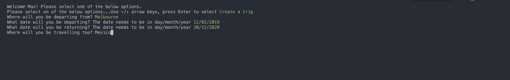


2. Download Itinerary 
    - Once the trips have been created the user can then simply download the itinerary to the CSV file called Itinerary.csv
    - The download itinerary feature used mainly methods, it read the file and then parsed an id incrementing it by 1 every time a new trip ws added. 

    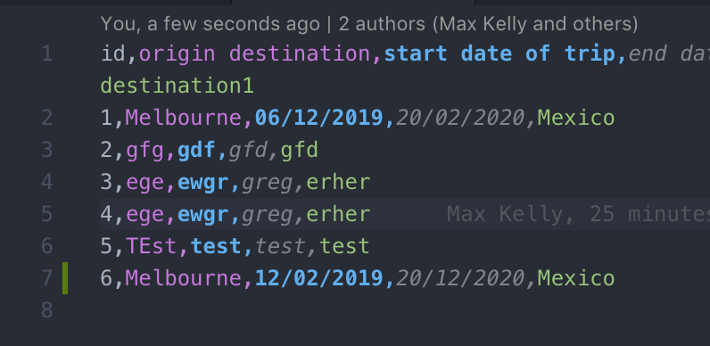

3. Spin the Globe
    - Spin the globe allows the app to randomly select a country the user will travel too. I implemented a spinner.
    - The spin the globe featured pulled its data from the countries.json file. This file contained data of countries and their states. We used the method below to read through the json file and then called the .sample method on the variable in app.rb.

    ```
    module Countries
        def self.countries(json_file)
            return json_file["countries"].map do |country|
                country["country"]
            end
        end 
    end}
    ```

    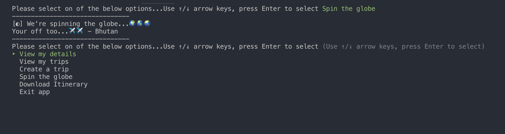

Develop an outline of the user interaction and experience for the application.
Your outline must include:
- how the user will find out how to interact with / use each feature
- how the user will interact with / use each feature
- how errors will be handled by the application and displayed to the user

# User Interaction and Experience
### How the user will find out how to interact with / use each feature

- The user will interact with each feature by selecting it on the user menu which is presented to them once they login. The user can then go into each feature by hitting the enter button on them.

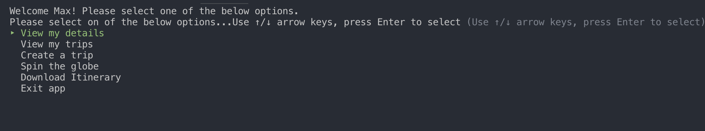

### How the user will interact with / use each feature

- The users will interact through the features by selecting them in the menu. Each of them are selected by hitting enter on each menu. 

### How errors will be handled by the application and displayed to the user
- The errors are handled three ways
1. Through automated testing (See code below)
2. Through manual testing (See spreadsheet link)
3. Through if and else statement + rescues (See example below)

```
def increment_id_test 
    # mock data
    data = [
        {
            origin_destination: "hshd",
            start_date_of_trip: "dhjskf",
            end_date_of_trip: "dhjksfh",
            destination: "hfjdhsk"
        }
    ]
    # setup, calling methods
    test_csv = 'test.csv'
    original_length = get_length_of_csv(test_csv)
    write_to_csv(data, test_csv)
    new_length = get_length_of_csv(test_csv)

    # test
    if original_length < new_length
        puts "Test passing!"
    else 
        puts "Test failing 😅"
    end 
end 

increment_id_test()
```
Below Google Spreadsheet

[Google Spreadsheet](https://docs.google.com/spreadsheets/d/1mnqyZbBl9RT1Z_rN7MKjGFAK8-Nhba_fc5WXT2etBJA/edit?usp=sharing)

```
begin
    file = File.open "countries.json" # Loads the the countries.json file    
rescue => exception
    puts "File does not exist"
end
```
### User Flow Diagram

- I created the user flow diagram on a program called Flowmap.
- You can view the project via this link: [UserFlow](https://app.flowmapp.com/share/3fad24876dbe39b06eaab674fe524125/userflow/46577/) or see the image below.

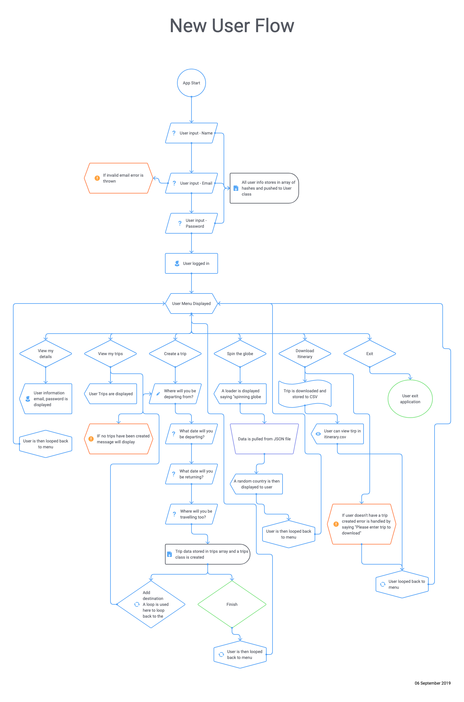

# Implementation Plan

I implemented and prioritised each feature of the app with the help of a project management tool Trello. See below images to show updates of each stage. I used checklists to help manage subcategories within the tasks. Along with this deadlines and 

- To view trello board please see the following link: [Trello Board](https://trello.com/b/rZJKsH1J)

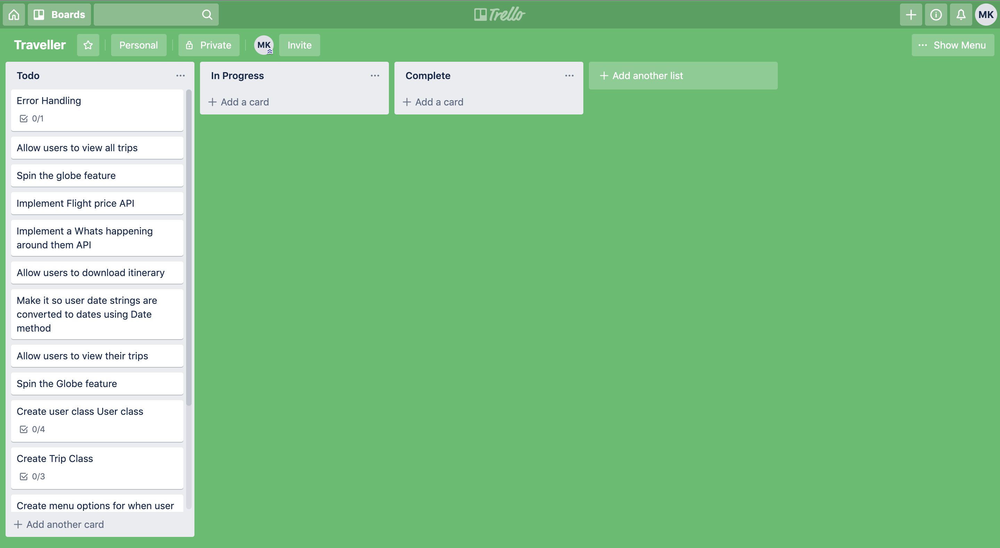
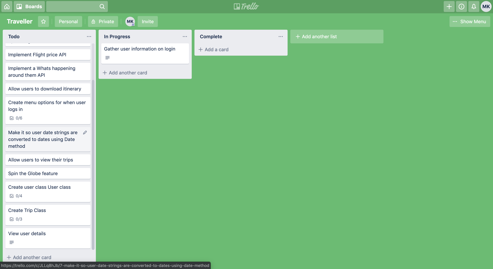
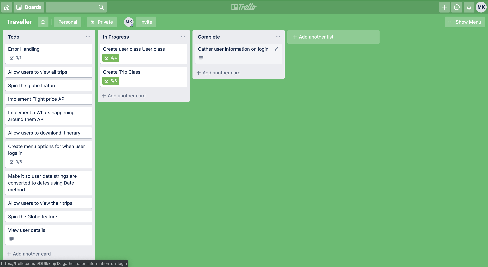
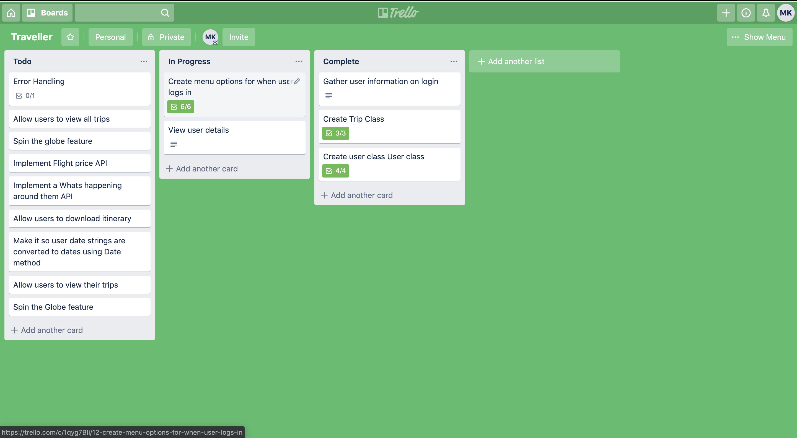
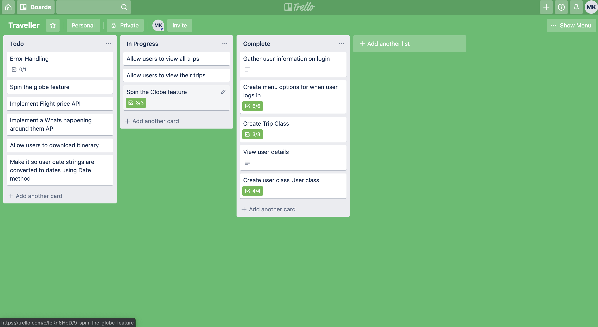
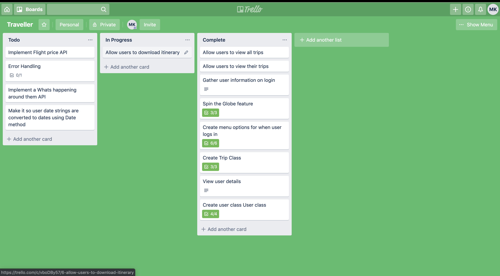
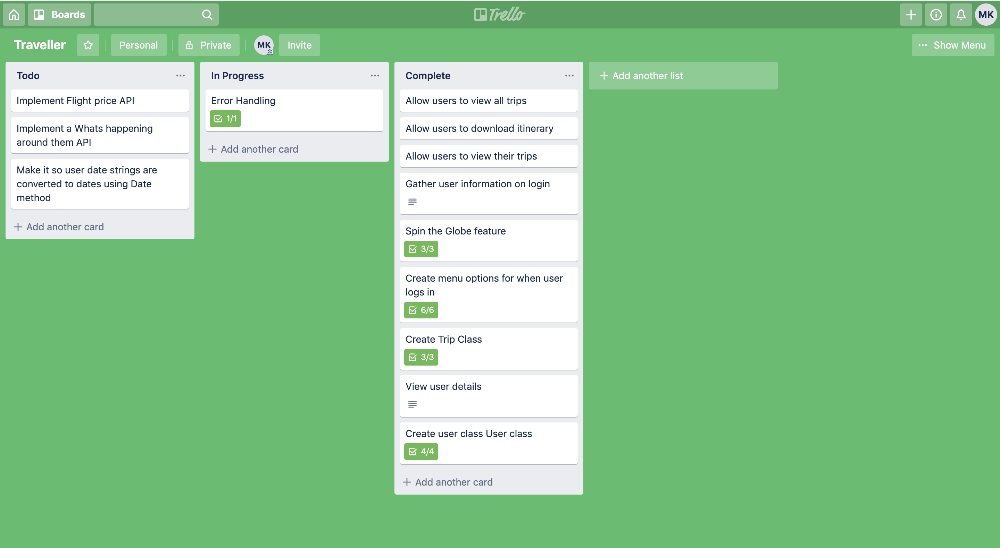
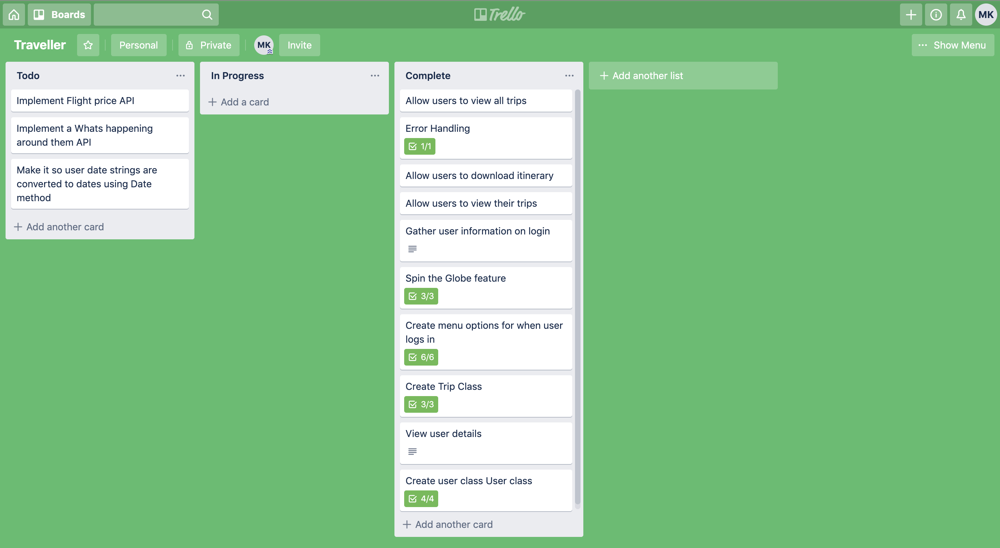
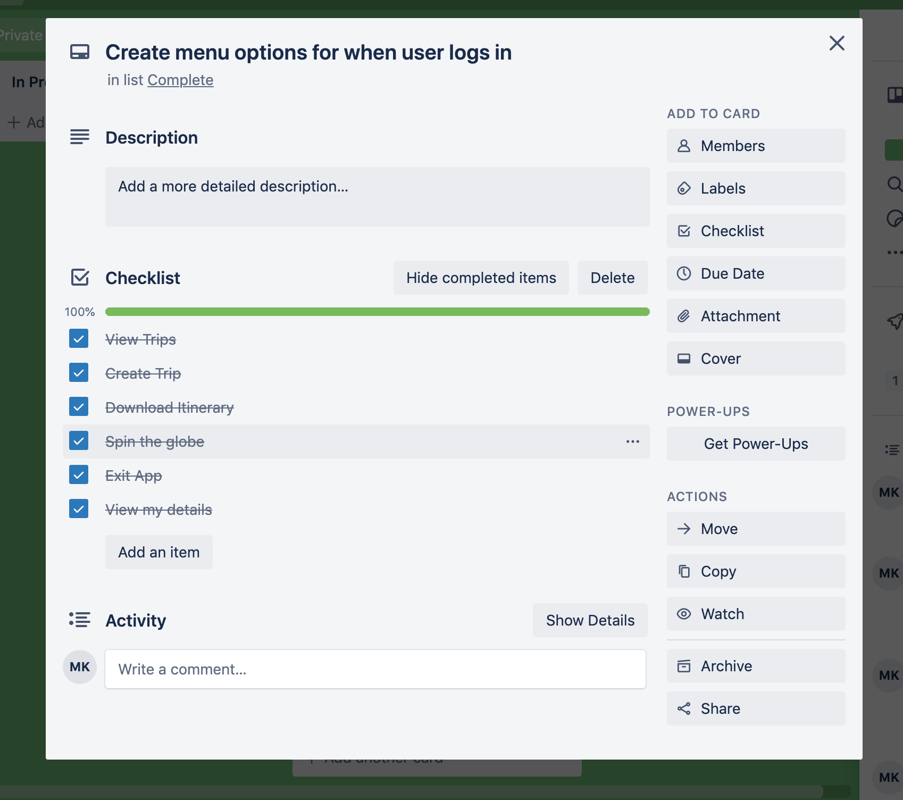
